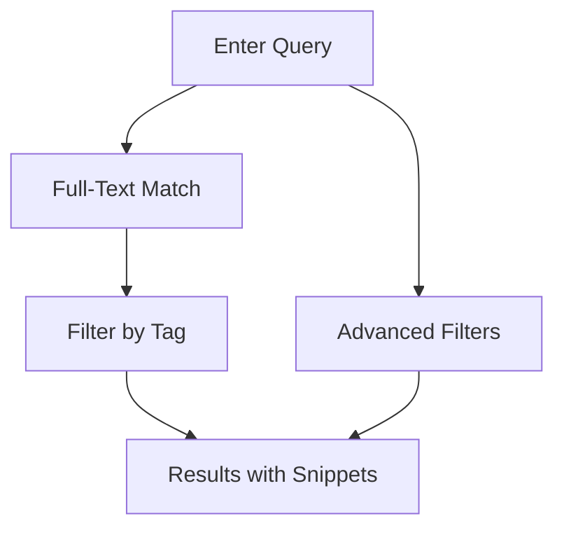

## Overview

Clear equips you with essential tools to streamline project documentation. Organize content hierarchically, track changes with version history, find information quickly through advanced search, and collaborate seamlessly with your team. These features help development teams, product managers, and writers maintain up-to-date docs efficiently.

<Columns cols={2}>
  <Card title="Document Organization" icon="folder" href="#document-organization">
    Structure your docs like your codebase with folders and pages.
  </Card>
  <Card title="Version History" icon="git-branch" href="#version-history">
    Track every change and revert when needed.
  </Card>
  <Card title="Search and Navigation" icon="search" href="#search-navigation">
    Locate content instantly across your entire space.
  </Card>
  <Card title="Collaboration Tools" icon="users" href="#collaboration">
    Review, comment, and merge docs together.
  </Card>
</Columns>

## Document Organization

Organize your documentation to match your project's structure. Create nested folders for APIs, guides, and references. Each page supports rich MDX content, including components and code blocks.

<Steps>
  <Step title="Create a Folder" icon="folder-plus">
    Navigate to your workspace root. Click the new folder icon and name it `api-reference`.
  </Step>
  <Step title="Add Pages" icon="file-plus">
    Inside the folder, create pages like `endpoints.mdx`. Use the editor to add headings and components.
  </Step>
  <Step title="Reorder Content" icon="move">
    Drag pages and folders to rearrange. Changes save automatically.
  </Step>
</Steps>

<Callout kind="tip">
  Use consistent naming like `v1.0-endpoints.mdx` for easy scanning.
</Callout>

## Version History

Every edit creates a new version. View diffs, restore previous states, or compare branches. Ideal for maintaining changelog accuracy without losing context.

<Tabs>
  <Tab title="View History" icon="clock">
    Open any page. Click the history icon in the toolbar to see a timeline of changes.
  </Tab>
  <Tab title="Restore Version" icon="rotate-ccw">
    Select a past version from the list. Preview diffs, then click `Restore`.
  </Tab>
</Tabs>

```javascript
// Example: Programmatic version fetch (via Clear API)
const versions = await fetch('https://api.example.com/docs/page-versions?slug=api-endpoints');
console.log(versions); // Array of {id, date, author, changes}
```

## Search and Navigation

Clear's search indexes all content, including code blocks and headings. Filter by tags, authors, or recency. Breadcrumbs and table of contents aid navigation.



<CodeGroup tabs="JavaScript,Python">
```javascript
// Search via API
const results = await fetch('https://api.example.com/search?q=authentication');
```
```python
# Search via API
import requests
results = requests.get('https://api.example.com/search?q=authentication').json()
```
</CodeGroup>

## Collaboration Tools

Invite team members to review drafts. Use comments, @mentions, and approvals before publishing. Track changes like in Git.

<Board title="Documentation Workflow">
  <BoardColumn title="Draft" color="0" icon="edit-3">
    <BoardCard title="Update API Guide" description="Add rate limiting section" author="Alice" createdAt="2024-10-01" />
  </BoardColumn>
  <BoardColumn title="Review" color="1" icon="eye">
    <BoardCard title="Changelog v2.1" description="Review new features list" dueDate="2024-10-15" author="Bob" />
  </BoardColumn>
  <BoardColumn title="Published" color="2" icon="check-circle">
    <BoardCard title="Quickstart" description="Initial setup instructions" createdAt="2024-09-20" />
  </BoardColumn>
</Board>

<Expandable title="Advanced Collaboration" default-open="false">
  Set granular permissions per folder. Use `@team-engineering` to notify groups. Export diffs as PDFs for audits.
</Expandable>

<Callout kind="success">
  Ready to try these features? Start with [Quickstart](/quickstart).
</Callout>